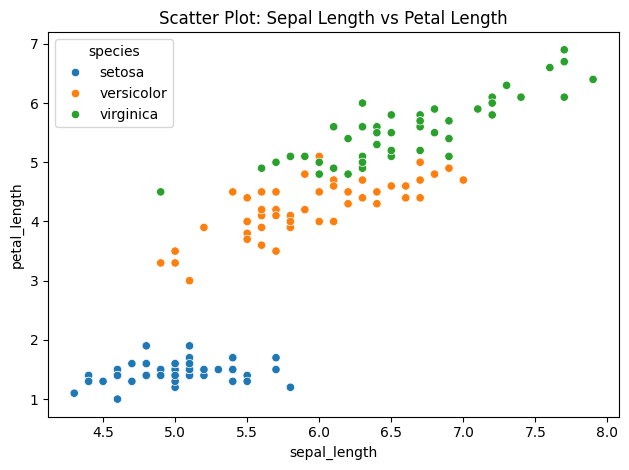
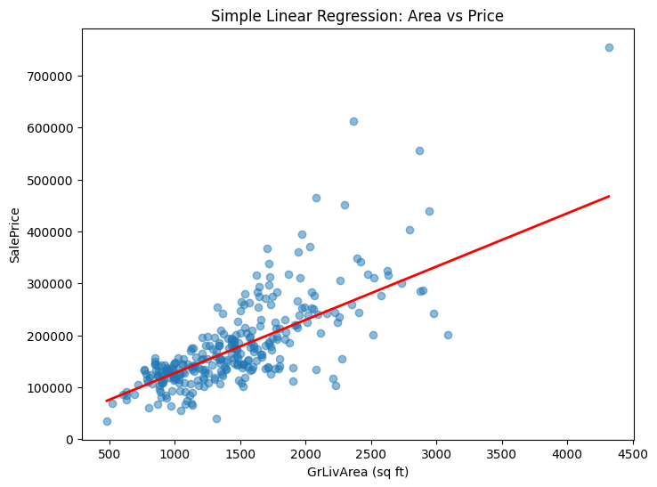
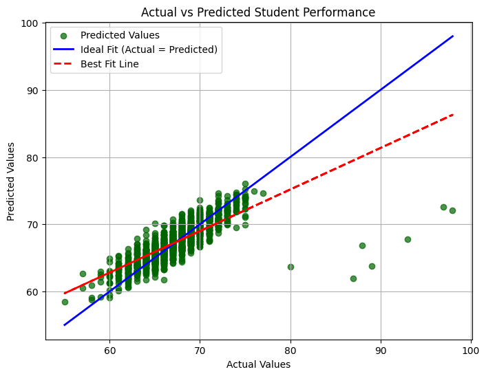
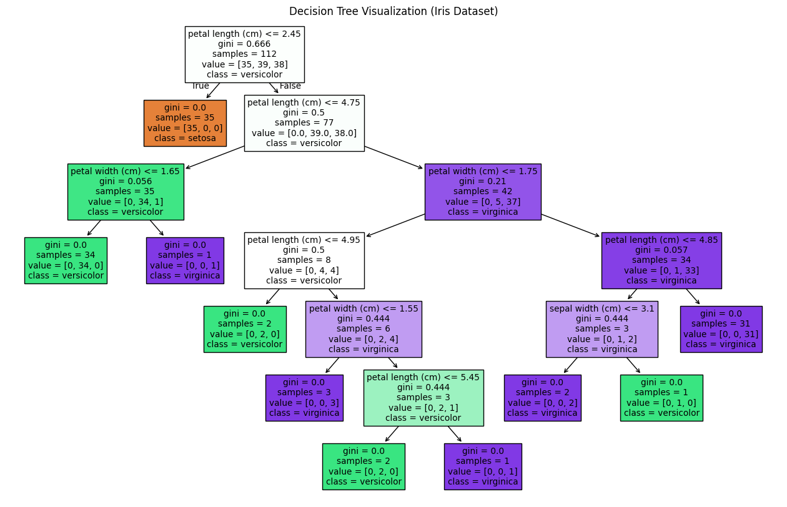
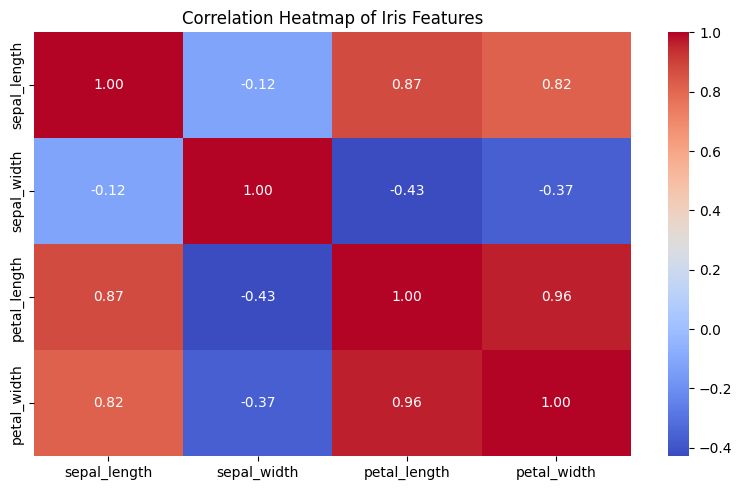
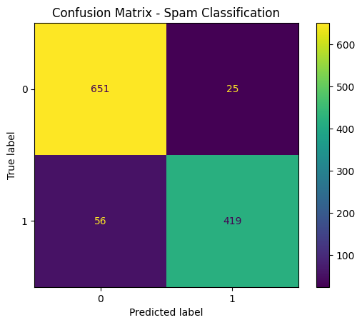
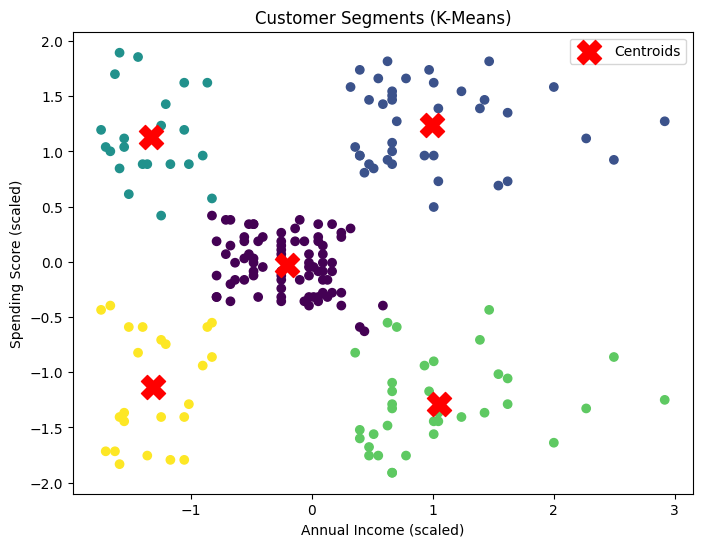
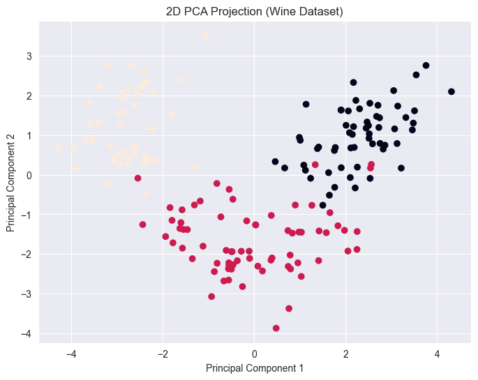
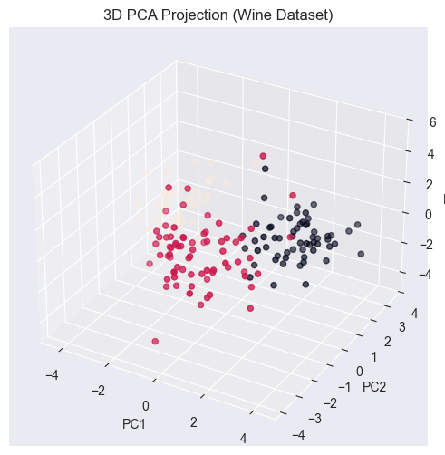

# 🚀 learning Machine Learning  From Regression to PCA

 

A structured, hands-on Machine Learning repository documenting my learning progression from fundamental regression models to advanced dimensionality reduction techniques.

---

## 📌 Overview

This project captures my **step-by-step journey** through core ML algorithms implemented using real datasets. Each module represents a lab session focusing on both **conceptual understanding and practical implementation**.

---

## 📘 Learning Roadmap

| Module | Algorithm                          |
| ------ | ---------------------------------- |
| 01     | Linear Regression                  |
| 02     | Multiple Linear Regression         |
| 03     | Logistic Regression                |
| 04     | Decision Tree                      |
| 05     | Random Forest                      |
| 06     | Support Vector Machine (SVM)       |
| 07     | K-Means Clustering                 |
| 08     | Principal Component Analysis (PCA) |

---

## 📊 Sample Output

  
  
  

  
  
  
  

  
  
  

---

## ⚙️ Tech Stack

* **Language:** Python
* **Libraries:** NumPy, Pandas, Scikit-learn
* **Visualization:** Matplotlib, Seaborn
* **Environment:** Jupyter Notebook

---

## 🚀 Features

* End-to-end ML workflow implementation
* Clean, modular lab-wise structure
* Real-world datasets for experimentation
* Visualization of model performance
* Both `.ipynb` and `.py` implementations

---

## 📈 What I Learned

* Difference between regression & classification
* Model evaluation techniques
* Bias vs Variance tradeoff
* Feature importance
* Dimensionality reduction using PCA

---

## 🧠 Future Improvements

* Add Streamlit dashboard for model demos
* Hyperparameter tuning (GridSearchCV)
* Model deployment

---

## 👨‍💻 Author

**Bijay Yadav**
📌 Aspiring Data Scientist | AI & ML Enthusiast

---

⭐ If you found this helpful, consider giving it a star!
